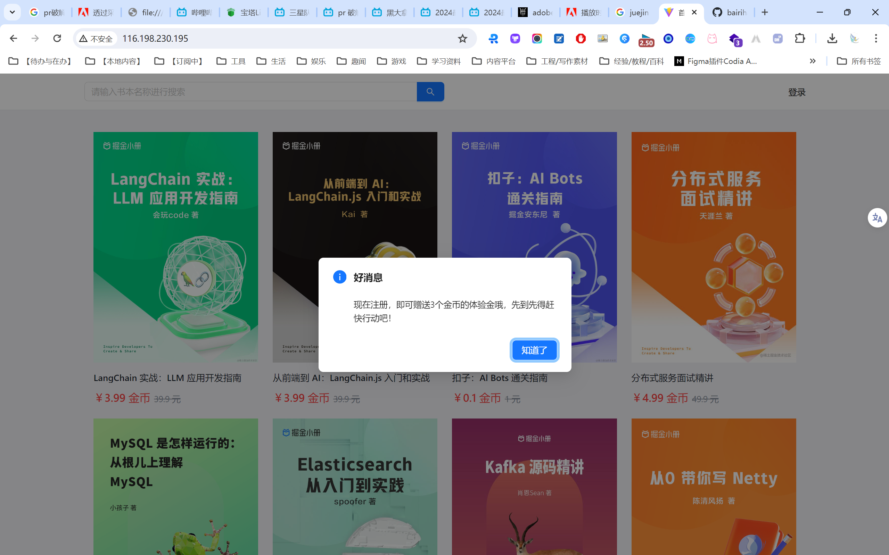

>  网页内容提供：淘宝@整只羊（现已关店）
>
> github action制作及部署维护：云都官能团@白日海
>
> dns解析：cloudflare CNAME(为避免too many redicts报错，不启用代理功能)

欢迎来到由云都官能团提供的掘金小册镜像。

您正在收看的小册是测试版，正在开发中。（2024年6月17日，19点06分）

本仓库使用Github action+action部署page实现CI/CD。

未来，本仓库还会新增更多小册镜像，之后，我们将停止action、page部分的维护，最后，我们将停止这里的更新，成为完成版的镜像站。

这是一个中短期项目，也没有版本表格什么的。Just enjoy it！

2024年6月19日 15点49分 ：

本仓库原名为Juejin-visResumeMook（一个简历平台小册的英文名），现已更名为Juejin-book-mirror。这样，将会开始新增更多小册。

>[!warning]
> **在收看/贡献小册镜像前，务必确认以下三点：**
>
> 1. 小册的版权归原版权所有者所有，您看到的内容仅为交流学习之用。**我们（云都官能团）不会收取任何钱财，要求您”购买“”付费“本镜像小册。**
> 2. 如果您喜欢本小册的内容，请通过fork/clone等形式进行保存副本。**本小册镜像随时可能下架，届时，我们可能不会预先通知，也不会发送您副本。**
> 3. 请遵守相关法律法规。参与贡献不可以修改原始网站静态数据。**参与贡献只可以修改workflow/page相关，网站原始文件由于淘宝关店现已停更，故不接受任何修改，请勿修改原始数据，避免意外的损失。**

>[!note]
> 另：如果您需要”收起侧边目录并打印为纸质版的功能“，很遗憾我们不能提供。
>
> 您需要自行将镜像小册html中的md部分dom进行复制，找个掘金网站的正版小册，进行粘贴进去。之后再那个正版小册页面收起侧边目录，最后进行打印。
>
> 在此过程中，可能涉及到img src的配置（如果github有防盗链规则的话），那么需要自己下载图片，部署到自己的公开cos/服务器，然后替换掉原来的图片链接。
>
> 另一种方式是通过pr 或者 issue的方式，提出关于收起侧边栏这一功能您的可行的想法。这样，我们未来可能可以新增收起侧边栏的功能。

---

您可以通过本仓库的page链接立即开始阅读。

[点击这里开始阅读](https://bairihai.github.io/Juejin-visResumeMook/)

这将要跳转到这些小册的目录。由github action自动生成。

---

我们还为您准备了一个通知模板，您的文件夹搬迁（如，原本的静态html要改为使用我们提供的部署）时，可以这样快速留下告示。

[通知模板](./这里原本有个掘金小册.md)

---

还准备了一个开发博客文档。这个文档我没有发布，你可以用于参考并学习制作流程，更可以参与金石计划什么的，把掘金的羊毛薅个干净。

[开发文档](./README 掘金小册线上部署须知.md)

---

您还可以以juejin book或是github这样的关键词自由搜索其他镜像站。当然了，可能更全，但也可能收费。这里就不做推荐啦。

